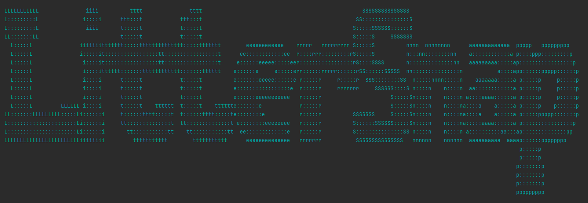

# Installation Guide

## Environment variables (setup as follows)

Step-by-step guide:


<span style="color: cyan">The program is creating the empty database with tables (also in the MySQL server) without running any script (due to the setup of application.properties)!</span>
<br>
<span style="color: darkcyan">Scripts are added to the project as it was requested!</span>


| Name               | Value                        | Remark            | Extra remark                                                                                                                                                 |
|--------------------|------------------------------|-------------------|--------------------------------------------------------------------------------------------------------------------------------------------------------------|
| DB_PORT_MYSQL           | 3306                         | default           | please user your own port that has been set to MySQL server                                                                                                  |
| DB_URL_MYSQL_LITTER_SNAP             | litter_snap                  | recommended       | you can use your own, our name is just a recommendation!                                                                                                     |
| DB_USER_MYSQL            | root                         | default           | please use your own!                                                                                                                                         |
| DB_PASSWORD_MYSQL        | no such info                 | pls use your own! | [MYSQL Installation Guide](https://dev.mysql.com/doc/mysql-installation-excerpt/5.7/en/)                                                                     |
| EMAIL_PORT         | 587                          | default           |                                                                                                                                                              |
| EMAIL_USER         | info.littersnap@gmail.com       | pls use your own! |                                                                                                                                                              |
| EMAIL_PASSWORD     | llpjrdsbulhtsxfr            | pls use your own! | [How-to-use-your-gmail-account-as-your-email-sender-via-smtp](https://www.jotform.com/help/392-how-to-use-your-gmail-account-as-your-email-sender-via-smtp/) |
| EMAIL_VALIDATOR    | you may use your own!        | please open the link | [EMAIL REGEX Pattern](https://emailregex.com/)                                                                                                               |
| PASSWORD_VALIDATOR | you may use your own!        | see value bellow  |                                                                                                                                                              |

EMAIL_VALIDATOR value as follows:


```(?:[a-z0-9!#$%&'*+/=?^_`{|}~-]+(?:\.[a-z0-9!#$%&'*+/=?^_`{|}~-]+)*|"(?:[\x01-\x08\x0b\x0c\x0e-\x1f\x21\x23-\x5b\x5d-\x7f]|\\[\x01-\x09\x0b\x0c\x0e-\x7f])*")@(?:(?:[a-z0-9](?:[a-z0-9-]*[a-z0-9])?\.)+[a-z0-9](?:[a-z0-9-]*[a-z0-9])?|\[(?:(?:25[0-5]|2[0-4][0-9]|[01]?[0-9][0-9]?)\.){3}(?:25[0-5]|2[0-4][0-9]|[01]?[0-9][0-9]?|[a-z0-9-]*[a-z0-9]:(?:[\x01-\x08\x0b\x0c\x0e-\x1f\x21-\x5a\x53-\x7f]|\\[\x01-\x09\x0b\x0c\x0e-\x7f])+)\])```

---

PASSWORD_VALIDATOR value as follows:

```^(?=.*[0-9])(?=.*[a-z])(?=.*[A-Z])(?=.*[!@#&()–[{}]:;',?/*~$^+=<>]).{8,32}$```


# Created by:

