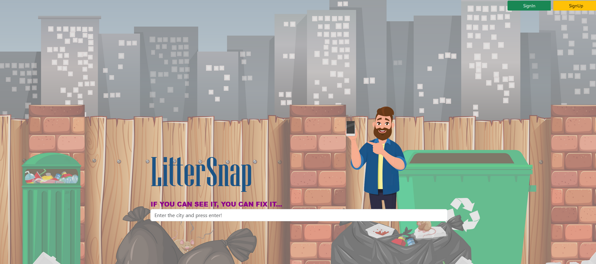

# We use server port: 8081 & our Website is responsive!

## Hosting plan

### We plan to use our existing domain: csaba79coder.com

## Backend Dependencies

- Java Development Kit - JDK 17
- Spring Boot 3
- Spring Framework 6

- Lombok
- ModelMapper
- Spring Data JPA
- Spring Hibernate
- Spring Web
- Spring Boot DevTools
- MySQL
- Spring Security
- Log4j2
- Validator

## Frontend Dependencies

- ThymeLeaf
- Bootstrap 5
- Html
- CSS
- JavaScript

## Test Dependencies

- JUnit 5
- Mockito
- JUnit Jupiter
- Spring Boot Test
- Spring Boot Starter Test
- Spring Boot Test Autoconfigure
- REST endpoints tested with Postman

## Basic setup

- See manual

## Basic coding rules

- Clean code (code readability in main the focus)
- OOP principles
- SOLID principles
- MVC pattern
- 3-tier architecture (Repository, Service, Controller layers)
- Common Error handling
- Creating separate REST API and Controller for Thymeleaf
- Uniform endpoints
- Collaboration on GitHub (branching, pull requests, code review)

## Future plan

- Create separate table for roles (and set a list of roles to the users)
- We plan to use our existing domain: csaba79coder.com
- We plan to make registration with social media
- We also plan to make a mobile app (and using google map's API there for the localization of the users)

# Created by:

